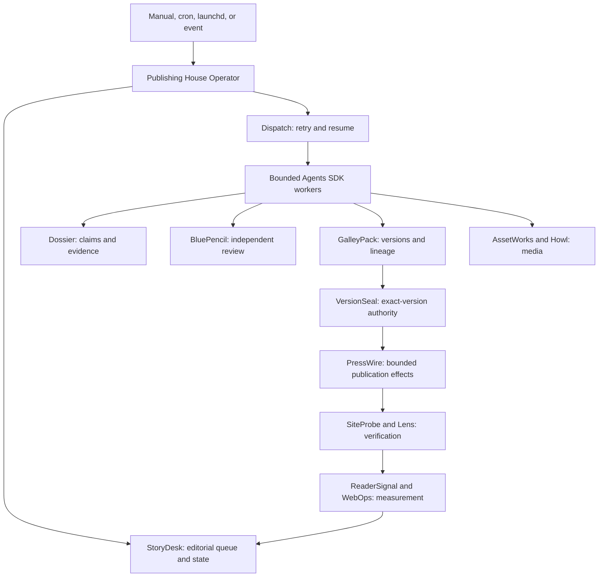

The Publishing House Operator is the small, durable control layer above Kujo's eleven Publishing House workflows, released in [kujo-workflows 0.4.0](https://github.com/kujolang/kujo-workflows/releases/tag/v0.4.0). It wakes for a manual, scheduled, or event-driven run, reads eligible work from [StoryDesk](/tools/storydesk/), acquires a local lease, selects the narrowest workflow, records checkpoints and receipts, and exits. Agents are bounded workers; they are not the scheduler, state database, or publication authority.

## Ownership



The operator stores leases, scheduling checkpoints, notifications, and references. It does not duplicate the durable responsibilities of the Publishing House tools. Publication profiles keep repository paths, voice, policy, commands, destinations, and verification rules out of agent prompts.

## Configure publications

The checked-in profiles describe:

- the personal blog, with an author voice distinct from Kujo product copy;
- `kujolang.ai`, including Markdown source, Kujo SSG, SiteKit validation, Howl cards, and GitHub Pages behavior;
- `docs.kujolang.ai`, with source-backed technical claims and docs-specific build checks;
- `agents.kujolang.ai`, where `kujo-agents` remains canonical and the site is a generated representation.

Profiles include source-of-truth paths, audience and mission, voice and style, formats and frontmatter, evidence and research rules, linking and search policy, assets and accessibility, build/test/preview commands, deployment, public verification, measurement, approval, refresh, correction, and rollback behavior. Adding another publication is configuration work:

```bash
publishing-house-operator/bin/publishing-house --json publication add ./my-publication.json
```

## Intake and planning

SourcePack preserves the original bytes of notes, transcripts, structured files, or other local sources before creating a normalized editorial view. Repeating the same intake returns the same deterministic SourcePack and StoryDesk identity.

```bash
publishing-house-operator/bin/publishing-house --json intake \
  --publication personal-blog \
  --format technical-essay \
  --priority high \
  --source ./rambled-notes.md
```

Weekly, monthly, campaign, release, and evergreen plans import deterministic StoryDesk commissions. Dependencies, priorities, publication windows, series, clusters, adaptations, and refresh lineage remain attached to the work.

```bash
publishing-house-operator/bin/publishing-house --json plan import ./september-2026.json
```

## Operate the queue

```bash
export KUJO_REPOS=/path/to/kujo-repos
export PUBLISHING_HOUSE_STATE=/private/path/to/publishing-house-state

publishing-house-operator/bin/publishing-house --json init
publishing-house-operator/bin/publishing-house --json doctor
publishing-house-operator/bin/publishing-house --json tick --limit 4
publishing-house-operator/bin/publishing-house --json status
publishing-house-operator/bin/publishing-house --json approvals
publishing-house-operator/bin/publishing-house --json blocked
publishing-house-operator/bin/publishing-house --json history
```

A tick is lease-protected, idempotent, retry-bounded, checkpointed, and safe to resume. It considers dependency-ready work up to its configured per-tick limit, while plan records preserve publication windows for workflow policy. An item failure does not stop unrelated publications. Routine success stays in summaries; approvals, evidence conflicts, source gaps, failures, policy violations, and deadline or budget risks become exception notifications.

The scheduler remains deliberately simple. Cron or launchd should invoke the same `tick` command with absolute state and repository paths. Event systems record a candidate with `event --input FILE`, then trigger a normal tick. Editorial routing remains inside the operator rather than the scheduler.

## Configure live execution

The operator is provider-portable. For non-fixture work, point it at one executable phase adapter:

```bash
export PUBLISHING_HOUSE_PHASE_ADAPTER=/absolute/path/to/phase-adapter
export PUBLISHING_HOUSE_PHASE_TIMEOUT_SECONDS=900
publishing-house-operator/bin/publishing-house --json tick --limit 4
```

The adapter reads a `publishing-house.phase-request` JSON object from stdin and returns a `publishing-house.phase-receipt`. The receipt binds the requested item and phase to an existing artifact and its SHA-256 checksum. Only the approval/publication phase may report an external effect, and a real effect must identify itself as published, corrected, or unpublished. The operator checks the receipt before advancing durable state.

The deployment adapter composes Agents SDK and AI SDK model workers, retrieval, and the appropriate Kujo tools. Publication effects still pass through PressWire. Credentials stay in the adapter's OS-backed environment and never enter the request, publication profile, prompt, or artifact tree.

Provider errors receive a bounded retry. The affected item then enters a hard blocked state without stopping unrelated work. After correcting the adapter, credential, evidence, or publication problem, release only that item:

```bash
publishing-house-operator/bin/publishing-house --json resume ITEM_ID
publishing-house-operator/bin/publishing-house --json tick
```

## Approval and publication safety

`REQUIRE_EXACT_HUMAN_APPROVAL` is the default. A profile may explicitly allow narrow, low-risk classes such as canonical agent-site sync, metadata fixes, or strongly sourced documentation corrections to flow automatically. The permission is publication-specific, content-class-specific, checksum-aware, and auditable. A changed artifact checksum invalidates its approval.

[VersionSeal](/tools/versionseal/) remains authoritative for the approved version. [PressWire](/tools/presswire/) remains the only publication-effect boundary. A successful file write, commit, or push is not a verified publication; configured public checks must pass before the record can claim success. Corrections, reversals, and unpublishing create new authorized effects and preserve the previous receipts.

## Events, documentation, and learning

Event intake classifies releases, CLI/API/contract changes, agent changes, broken pages, stale evidence, search opportunities, and performance changes. It creates policy-selected StoryDesk candidates rather than publishing directly.

Documentation claims must trace to source, tests, CLI help, schemas, contracts, or release artifacts. Agent-site work distinguishes a canonical edit in `kujo-agents` from regeneration and verification of `agents.kujolang.ai`. ReaderSignal and WebOps observations may propose refreshes, follow-ups, internal-link changes, adaptations, or retirement; they do not silently rewrite published work or overstate causation.

## Production deployment gates

The checked-in operator now has the live execution boundary, validated receipts, bounded retries, blocked-item recovery, durable state, and exact-version authority needed for production operation. Deterministic mode remains available for rehearsal and clean-machine verification; it is not the operator's only execution path.

Each installation still supplies its chosen model and retrieval providers through the phase adapter. Repositories that permit automated Git effects also require a configured, authenticated PressWire Git/static provider, and enabled measurement sources require their ReaderSignal or WebOps credentials. These are explicit deployment gates because they carry provider, repository, and publication authority. Missing gates block the affected item; they do not cause a fixture fallback or a false success.

See the [Publishing House Operator 0.4.0 source](https://github.com/kujolang/kujo-workflows/tree/v0.4.0/publishing-house-operator), the [official release](https://github.com/kujolang/kujo-workflows/releases/tag/v0.4.0), and the [Editorial publishing ownership guide](/build/editorial-publishing/).
