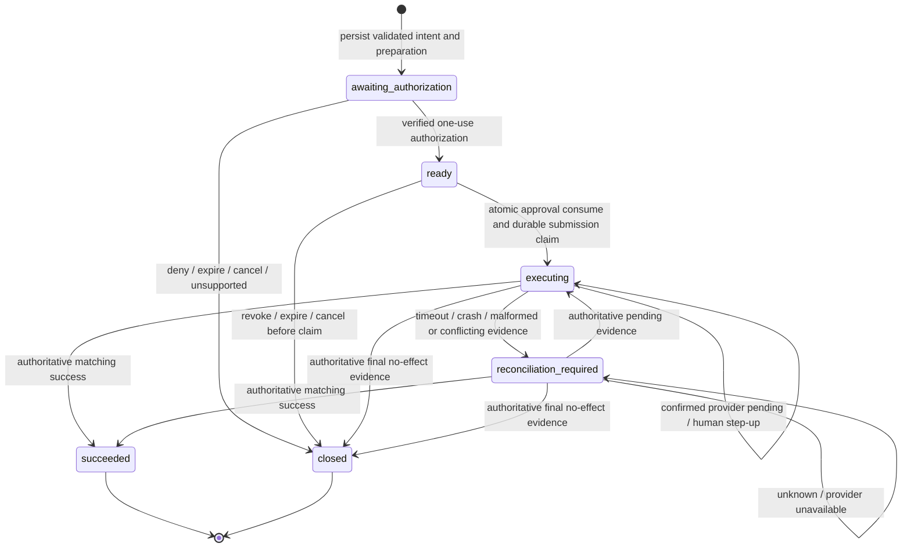

# Durable lifecycle and reconciliation

## State machine

`draft`, `validated`, `authorized` and `execution_ready` are collapsed into validation work plus one durable `ready` state. `closed` carries a reason (`denied`, `expired`, `cancelled`, `unsupported`, `failed_no_effect`). This avoids treating a timeout as a terminal failure. Post-submission provider action is retained inside `executing`, not confused with initial authorization.



Preparation may need account setup or provider approval; `awaiting_authorization` has a reason and opaque action reference. No money or remotely spendable grant may be created by prepare. A provider whose human redirect both authorizes and transfers money must initiate that redirect **during submit**, after the durable claim, rather than pretending it is harmless authorization preparation.

| From / event | Preconditions and atomic changes | Invalid behavior |
|---|---|---|
| Absent / intake | Authenticated identity; valid bounded input; unique purchase_ref and key; persist intent before provider preparation. | Conflict on changed payload for existing key; no overwrite. |
| awaiting / authorize | Exact immutable snapshot; verified issuer/provider evidence; unexpired; save approval reference and revision. | Forged, stale or mismatched approval rejected, no state advance. |
| ready / claim | Compare revision; check policy/expiry; consume approval and set `submission_claimed=true`; save operation key and outbox entry in same database transaction. | One claimant wins; others inspect. Missing audit/journal persistence means no external call. |
| executing / evidence | Authenticated evidence maps exact route, account, merchant, amount and transaction; CAS revision; append evidence and state. | Unknown enum, malformed response or disagreement becomes reconciliation; never infer no effect. |
| Any terminal / repeat | Return immutable final outcome or conflict; append independent dispute/correction evidence if needed. | Never reopen to `ready`; no key reuse, no automatic new provider. |

All other transitions return a typed `invalid_transition` and current revision, without invoking a provider. Duplicate events deduplicate by provider/account/event ID and evidence digest. Changed event content under an existing ID is quarantined. Out-of-order events cannot regress a verified outcome. Contradictory late evidence opens an operator incident annotation; it never authorizes another charge. Refund/chargeback events do not rewrite purchase success into no payment.

## Reference persistence and concurrent execution

Use a single-host SQLite database on local durable storage for V1 (`WAL`, `synchronous=FULL`, foreign keys), owned by executor OS principal. Database transaction semantics must be verified through the selected Kujo native database API. Do not deploy SQLite on a shared network filesystem or promise multi-region writers. A future database store can implement the same transactional obligations without changing payment semantics.

Minimum tables:

```text
intents          PK(tenant_id, intent_id), UNIQUE(tenant_id, principal_id, purchase_ref)
request_keys     PK(tenant_id, principal_type, principal_id, key_hash), request_digest, intent_id
executions       PK(execution_id), UNIQUE(intent_id), snapshot_digest, revision, state, submission_claimed
approvals        PK(approval_id), binding_digest, issuer, nonce UNIQUE, expiry, consumed_execution_id
provider_state   PK(execution_id), private account/route mapping, external IDs, credential references
observations     PK(execution_id, evidence_id), digest, source, outcome, observed_at
outbox           PK(execution_id, event_kind, revision), metadata only
```

`UNIQUE(intent_id)` is safe only with globally unique server IDs; all queries additionally enforce tenant/principal ownership. Provider-state rows are never serialized through Ability. Credentials remain in a dedicated store or transient executor memory, not journal JSON. Persist only necessary references and authenticated observation fields; encryption at rest does not authorize giving ciphertext/key pairs to an agent.

The claim transaction is the linearization point for **at-most-once dispatch**. Before sending, the worker owns a permanently recorded submission claim. V1 makes at most one potentially charge-bearing network submission per execution, with transport/proxy retries disabled. If the process dies before sending, this can strand an unspent intent; the safe recovery is observation or operator review, not “lease expired, send again.” A stale worker lease does not clear `submission_claimed`.

Prepare and approval-notification work have separately named operation keys. Repeating notifications or credential preparation after timeout is allowed only if proven idempotent or authoritatively absent and incapable of moving funds. The current Link SDK accepts a body `idempotency_key` for SpendRequest creation; the server retention and conflict contract still requires verification. Issuance idempotency and duplicate-SpendRequest recovery do not establish merchant charge idempotency. Persist the local preparation claim; an ambiguous create is looked up/correlated or stopped, not blindly repeated.

Reuse Ability's begin/complete hooks for invocation deduplication. Its consume hook can atomically reserve the execution row with approval consumption. Handler subsequently recognizes that reservation as belonging to the same invocation. If the process stops between consume and handler, the executor remains reserved and recovery observes; do not issue another approval automatically. Separate operation and financial rows exist because Ability's completion audit is not atomic with provider settlement.

## Failure semantics

| Fault | Authoritative result / recovery |
|---|---|
| Validation or policy denial before preparation | No provider submission; closed reason, safe bounded error. |
| Approval request timeout | Keep awaiting state with unknown preparation/authorization observation; no duplicate create unless safe lookup proves absence. |
| Provider confirms pending or bank redirect/3DS needed after submit | `executing` plus typed human action, no further charge request. |
| Network timeout, socket close, 5xx after dispatch, unexpected HTML/JSON, worker crash | `reconciliation_required`; bytes sent or not sent is unknown unless transport can prove non-dispatch. |
| Provider success; local receipt write fails | Durable preexisting claim still blocks resubmit. Recover using provider/merchant references; do not turn failed audit into no charge. |
| Mandatory audit write fails before claim | Stop before charge. |
| Optional telemetry delivery fails after success | Keep financial success; retry sanitized outbox delivery only. |
| Charge succeeded but fulfillment/order creation failed | Record financial success plus fulfillment exception; application/Commerce owns recovery. Never charge again to fix fulfillment. |
| Partial amount, excess amount, wrong merchant/currency, conflicting references | Quarantine as reconciliation incident; record observed amount; no automatic compensation or new charge. |
| Provider disappears or account access is revoked | Preserve unresolved journal and reservations; export safe evidence for operator inquiry. Do not fail over an already authorized execution. |
| Backup restored before latest charge state | Live execution remains disabled until restore reconciliation completes; old approvals/keys cannot be trusted for dispatch. |

## Observation and terminal evidence

`observe(execution_id)` retrieves authorization or execution facts using executor-private references. It is read-only with respect to money. Its result is `pending|authorized|denied|expired|succeeded|failed_no_effect|unknown` plus stage. `authorized` is legal only before submission; post-submission success requires actual_amount and evidence matching exact charge/payee. A provider cancellation response for an approval object is not proof of no charge.

Provider `not_found` is **unknown**, unless a documented authoritative lookup proves no financial effect and the original worker is conclusively terminated. Even then V1 closes the old execution; a new purchase needs new human authorization. No observe/reconcile method can reset the submission flag or mint a new financial attempt.

Prefer signed, authenticated callbacks when the provider actually supports them. Verify signature, account, timestamp tolerance, event replay and stored transaction mapping, then independently retrieve where necessary. For Link, do not invent webhook support: bounded executor polling is the baseline. Proposed default poll schedule: 5s, 15s, 30s, then 60s while authorization remains valid; after ambiguity use 1m, 5m, 15m and operator review. Limits are operator-configurable; no model polling loops. Persist next due time and stop scheduling on expiry/terminal state, while permitting operator reconciliation later.

The system promises a bounded local invariant under the declared storage and worker assumptions. It cannot prove that a compromised provider never charges twice, that settlement can always be recovered during a permanent outage, or that every approved purchase eventually completes.
