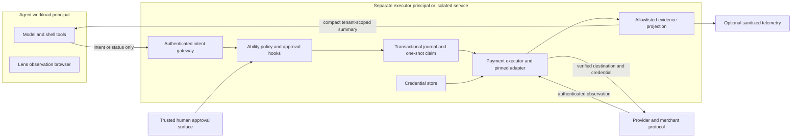

# Security architecture and threat model

## Overview

This model covers the proposed Payments boundary and inspected Kujo integration paths. Existing code facts are distinguished from **proposed** controls. Threat scenarios below are design threats, not vulnerability disclosures about the existing repositories. No live credentials were accessed.

The agent browser never receives a resolved payment profile, token, raw approval URL, privileged endpoint, or provider session. The model can propose an intent and read its own status. It cannot execute arbitrary code in the privileged process. The OS/service transport enforces this division; a function name or instruction does not.

## Effective resources and deployment assumptions

| Deployment/workflow | Resource and configuration | Effective location / recipients | Control and evidence |
|---|---|---|---|
| Existing Workcell OCI agent | Disposable workspace from validated TMPDIR, then `/kujo-workcell-<run_id>`; mounted at configured workspace path | Workload gets writable checkout, not host home by default | `workcell/src/workspace/workspace.kujo:5`, `:166`; `policy/policy.kujo:153`; inspect all actual mounts in deployment. |
| Existing Workcell engine client | DOCKER_CONFIG override, otherwise host HOME/.docker; connection selectors restored to engine client | Trusted host Docker CLI, not automatically workload env | `workcell/src/runtime/docker.kujo:329`; client config authority differs from agent environment. Dirty source snapshot. |
| Existing Workcell declared secrets | definition.secrets → host environment → explicit container environment | **Workload receives declared values** | `workcell/src/policy/policy.kujo:228`. Payments profile must declare no payment secrets. |
| Existing Workcell egress | `network.mode` maps to engine network | `none` denies network; non-none requires actual egress policy | `policy/policy.kujo:53`, `:122`; portable OCI rejects domain allowlist `execution/portable_oci.kujo:32`. |
| Existing Lens auth file | program.auth_file → Playwright storageState | Full authenticated browser context | `lens/bridge/flow-bridge.js:192`. No safe payment-browser handback exists. |
| Existing Leash daemon | argv config or cwd/config.yml; configured DB path passed directly | Daemon OS principal; relative `./leash.db` uses process cwd | `leash/daemon/src/main.rs:33`, `:103`; `config.rs:105`. Unix file mode does not establish Windows ACL protection. |
| Existing hosted Ability Gateway | CONTROL_DB Worker binding | Approvals/idempotency/membership/audit tables | `ability-gateway/src/api.ts:38`, `:131`; correct tenant SQL predicates, but current application performs preview only. |
| Proposed local Payments service | Operator-owned absolute state/vault paths outside agent mounts; separate OS identity or isolated guest | Executor only; no shared home, TMPDIR, sockets, browser profile or process namespace | Deployment obligation; not yet implemented or tested. Same user plus chmod 0600 is insufficient against that user's agent shell. |
| Proposed self-hosted remote service | Authenticated TLS gateway, per-tenant store/vault, outbound verified provider/merchant destinations | Service identity; user device for approval | External identity, authorization, key custody and egress controls required. No proprietary Kujo cloud. |

Built-in Docker/Podman can be the declared containment boundary, conditional on host configuration. A shared kernel is not a microVM guarantee. gVisor/Kata choices require actual runtime configuration and tests; remote Workcell adapters have separate acceptance obligations. Host administrator, hypervisor compromise, provider compromise and trusted adapter compromise are not defeated by agent tool filtering.

## Trust boundaries, assets and controls

Protected assets: payment credentials, payer authority, merchant identity, authorized amount/currency, nonce/approval integrity, tenant separation, financial journal, provider correlation, and private purchase history. Attacker starts with merchant content or arbitrary execution inside the agent workload, not executor credentials or host root.

Payment data is **not public merely because it is not a secret**. Amount, merchant, SKU, order ID and history can reveal sensitive purchases. Default classification is tenant-sensitive. Agent projection exposes only authorized task context and bounded status. Brand/last four and raw shipping/billing/email fields add little execution value and stay private. Payment/shipping aliases resolve under authenticated principal and versioned records.

Secrets include PAN, CVC, OAuth access/refresh tokens, SPT, LPT, wallet/bank credentials and provider keys. Do not permit them in model context, tool outputs, Ability receipts, Dispatch state/traces, Watchdog, RunLedger, CaseFile, Workcell context/artifacts, stdout/stderr, exceptions, screenshots, DOM/HTML dumps, HAR/network traces, debug bundles or telemetry. Disable shell tracing, request-body logs, exception interpolation and core dumps for the executor; constrain swap/backups and use supported secure storage. Managed-runtime memory zeroization is best effort, not a proven guarantee. Credential revocation and short lifetime remain provider controls.

Gateway requests are schema/size validated before any audit records input. Strict allowlisting prevents accidental provider object propagation, but arbitrary strings can contain secrets. Therefore caller-supplied free text is not echoed into logs; pre-model exposure still depends on the agent never receiving credentials. Synthetic sentinel tests measure accidental leakage, not impossibility of exfiltration by a fully compromised trusted adapter.

Human action refs resolve to trusted authenticated pages. Do not let a merchant supply an arbitrary approval URL; validate destination/issuer and protect against CSRF, OAuth state/PKCE confusion and callback replay. MCP URL elicitation can present that page, but clicking accept or returning from it is not authorization evidence.

## Threats and mitigations

Priority reflects financial impact under the stated prerequisites; each row is a design test requirement.

| Priority | Scenario / capability gain | Prerequisite and impact | Existing evidence / proposed mitigation |
|---|---|---|---|
| High | Credential theft through tool, file or environment | Agent shell shares host user/vault; theft enables unauthorized spending | SDK handler is in-process. Separate principal/guest, no payment mounts/env/sockets; runtime breakout tests. |
| High | Shell breakout into provider CLI/session | Broad host shell or engine socket reaches privileged resources | Workcell mount/env controls help conditionally. Remove host shell/daemon access, provider binaries and privileged IPC from agent. |
| High | Prompt injection changes destination or terms | Merchant page/tool response influences execution arguments | Lens safety flag is not approval. Freeze verified route and exact snapshot; no arbitrary credential-bearing requests. |
| High | Merchant substitution / redirect / DNS rebinding | Same name or compromised URL points to other payee | Bind registry and provider account, disable redirects, enforce resolved egress policy and TLS; do not trust display name alone. |
| High | Price or currency substitution / integer overflow | Edited amount after approval or imprecise conversion | Strict integer/currency validation; exact total in snapshot; changed terms require approval. |
| High | Shipping/cart/resource mutation | Fulfillment version/body differs from approved purchase | Bind profile version, terms digest, SKU quantities and request template; revalidate immediately before submit. |
| High | Forged approval or approval replay | Attacker recomputes hash or supplies approval=true | Ability hash validates binding, not issuer. Authenticated store lookup, issuer authority and atomic one-use nonce consumption. |
| High | Execution replay / concurrent workers | Same or new transport key repeats an authorized purchase | Tenant purchase_ref uniqueness; atomic persistent claim; one-shot submit; no lease-based automatic resend. |
| High | Crash after charge / network loss | External effect before local outcome commit | Persist claim before network; unknown becomes reconciliation; inspect exact provider transaction. |
| High | Tenant/principal confusion | Global aliases, unscoped references or forged IDs | Server-resolved identity on every lookup; bind principal/tenant/account; negative cross-tenant tests. |
| High | Adapter confusion or unauthorized failover | Different adapter/account/class after approval | Registry/version/digest pin; route frozen in snapshot; no provider fallback for an existing execution. |
| High | Provider compromise or malformed response | Provider/merchant returns false success, huge payload, credential fields | Authenticated evidence, byte limits, strict enums, independent transaction lookup where available; conflicting evidence quarantined. Provider fraud remains external trust risk. |
| High | Browser credential leakage | Raw card or token appears in DOM/network/profile/trace | Entire browser injection class excluded from V1; no shared profile, page or context for later design. |
| High | Audit/telemetry leakage | Raw requests/errors copied across integrations | Typed egress projection; no raw provider error; sink-by-sink sentinel tests, disabled debug paths. |
| High | Supply-chain compromise | Adapter/CLI/runtime updated or installer executes hostile code | Exact pins/checksums, approved distribution, separate build/execution identities, no runtime npx/install, artifact provenance. |
| High | Backup rollback resurrects approvals | Restored DB lacks most recent charge claim | Fail-closed restore mode; reconcile before reenable; retained tombstones; never recreate used IDs. |
| Medium–High | Callback spoof/replay or out-of-order events | Remote event endpoint accepts untrusted event | Authenticate signature/account, bounded timestamp/replay cache, content digest and monotonic state; no callback direct submit. |
| Medium–High | Approval flooding / quota exhaustion | Authorized requester loops new intents | Per-principal outstanding/rate limits; no implicit standing authority; pause endpoint; bounded poll jobs. These are resource limits, not a new financial policy language. |
| Medium | Purchase-history inference | Guessable IDs or broad telemetry visibility | Random opaque IDs plus authorization; no list/history tool; tenant-scoped evidence access and retention. |
| Medium | Journal/audit disk exhaustion | Provider outputs unbounded evidence or failed telemetry blocks process | Maximum body/evidence sizes, quota alarms, no submit when journal cannot commit, bounded outbox. |
| Medium | Cancellation race | Human cancels while worker submits | CAS on ready revision; either cancel wins before claim or report in-flight. Never present cancel as undo. |

## Browser design decision

Lens can inspect public catalog/cart data and test sanitized success pages. Its `safe=true` gate is caller-authored, and auth files grant full session access. It cannot establish secret-isolated checkout by hiding tool output.

A later browser executor must launch a fresh exclusive browser under executor identity, reconstruct checkout from verified terms, disable screenshots/video/DOM/HAR/traces for its lifetime, validate frames and origins, inject credentials and verify transaction evidence, then destroy the context/profile. A general agent cannot attach over DevTools, share cookies/extensions, or receive the used page. Show a newly fetched sanitized order projection instead. Deleting files is not a secure-erasure guarantee on snapshots/SSDs; prefer ephemeral encrypted storage and provider revocation. No browser injection, including LPT, ships in V1.

## Severity calibration and assurance

Critical example: unauthenticated remote arbitrary execution in a deployed multi-tenant executor with reachable credentials. No such deployed vulnerability is established here. High example: an agent can replay an approved purchase by resetting a durable claim. Medium example: tenant-scoped purchase metadata leaks to a broader audit viewer. Low example: a harmless schema diagnostic is too verbose without confidential content.

Ordinary access by an already-trusted executor administrator is not an agent privilege escalation. Provider fraud, host-root compromise and a hostile trusted adapter require separate organizational/operational controls. Architecture promises only the specified boundary; tests must prove its behavior on an actual target deployment. No PCI, enterprise-readiness, universal sandboxing or production-security claim is made.

## Independent boundary review

A fresh-context, read-only reviewer independently traced Ability, Agents SDK, Dispatch, Workcell and Commerce on 2026-09-12. It confirmed the proposed ownership split and identified the receipt replay identity constraint now specified in [contract details](10-contract-details.md#gateway-replay-identity). Its review was architecture mapping, not an exhaustive vulnerability scan or deployment certification.

Additional effective resources: Dispatch always exports redacted filesystem `state.json`, `trace.json`, `trace.md` and `otel-traces.json` beneath `<output_root>/<run_id>`, including with SQLite enabled; SQLite is `<output_root>/.dispatch/state.db` (`dispatch/src/core/state.kujo:884`, `dispatch/src/core/state_store.kujo:14`). Both copies must receive only the same sanitized payment summary. Ability's handler receives trusted services in process (`ability/src/runtime.kujo:235`); that callback boundary is not isolation. SDK direct local Ability projection can call a handler without authoritative runtime execution (`agents-sdk/src/agents/abilities/contract.kujo:34`); use the authenticated gateway projection for payment requests. Dispatch's absent tool policy and auto-approval options cannot bypass payment authorization because execution authority is enforced beneath that layer.
